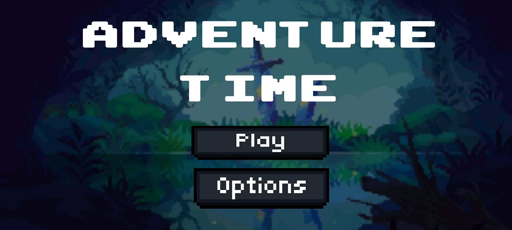
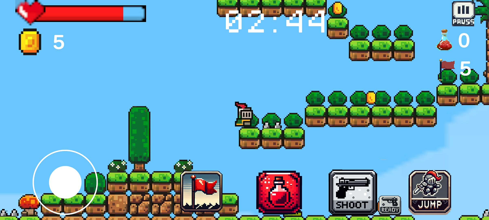
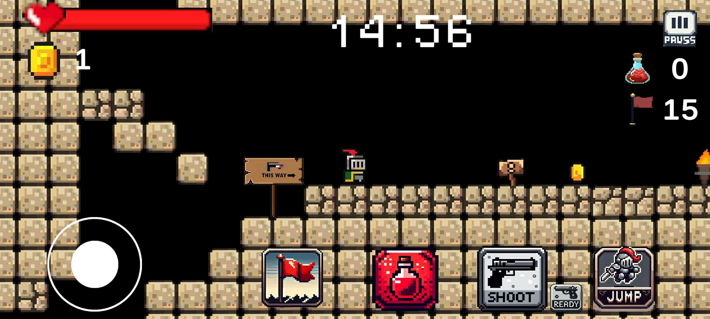
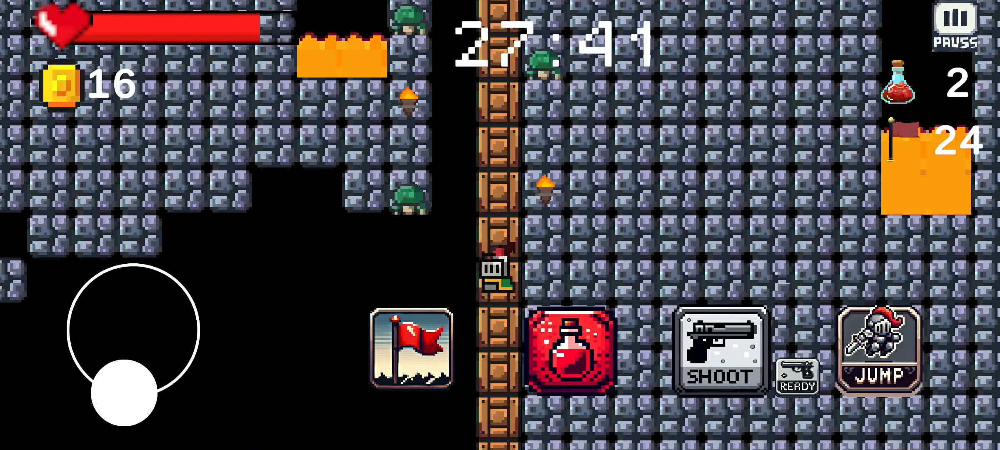

<div align="center">

# ⚔️ Adventure Time 2D RPG

**🎮 Link DEMO:** [https://tulklk.itch.io/adventure-game](https://tulklk.itch.io/adventure-game)

<p>
  
  
</p>
<p>
  
  
</p>
**Game 2D platformer / adventure — Solo project**

[](https://unity.com/)
[](https://docs.microsoft.com/dotnet/csharp/)
[]()
[]()
[]()

[Giới thiệu](#-giới-thiệu) • [Tính năng](#-tính-năng) • [Công nghệ](#-công-nghệ) • [Chạy project](#-chạy-project)

</div>

---

## 📖 Giới thiệu

**Adventure Time 2D RPG** là game phiêu lưu 2D side-scrolling do một người phát triển trên Unity. Người chơi điều khiển hiệp sĩ vượt qua 3 màn chơi, thu thập vật phẩm, chiến đấu với quái vật và đối đầu boss đa giai đoạn trong thời gian giới hạn.

> 🎯 **Mục tiêu:** Hoàn thành level, ghi điểm cao và đạt tối đa 3 sao để mở khóa màn tiếp theo.

---

## ✨ Tính năng

| | |
|---|---|
| 🏃 **Điều khiển** | Di chuyển, nhảy, trượt/nhảy tường, leo cầu thang, đu dây |
| 🔫 **Combat** | Bắn đạn, AI enemy, boss 3 phase với nhiều đòn tấn công |
| 🎒 **Item** | Coin, súng, bình máu — mở rương kho báu |
| 🗺️ **Level design** | Platform di chuyển/rơi, jump pad, teleporter, checkpoint |
| ⭐ **Progression** | Scoring, đánh giá sao, mở khóa level, lưu tiến trình |
| 📱 **Mobile-ready** | Virtual joystick, UI cảm ứng, Google Mobile Ads |

---

## 🛠️ Công nghệ

`Unity 2022.3` · `C#` · `TextMesh Pro` · `DOTween` · `Google Mobile Ads` · `PlayerPrefs`

---

## 🚀 Chạy project

1. Clone repository
   ```bash
   git clone https://github.com/tulklk/AdventureTime2DRPG.git
   ```
2. Mở project bằng **Unity Hub** (phiên bản **2022.3.30f1** trở lên)
3. Mở scene `Assets/Scenes/Menu.unity` và nhấn **Play**

---

## 📁 Cấu trúc chính

```
Assets/
├── Scenes/          # Menu, Level 1-3, CutScene, Loading
├── Scripts/         # Gameplay, AI, UI, Audio, Ads
└── docs/            # Icon & screenshot cho README
```

---

## 👤 Tác giả

**Unity Game Developer** — Solo project  
📧 Portfolio / liên hệ: thêm link của bạn tại đây

---

<div align="center">

⭐ Nếu project hữu ích, hãy star repo để ủng hộ!

</div>
